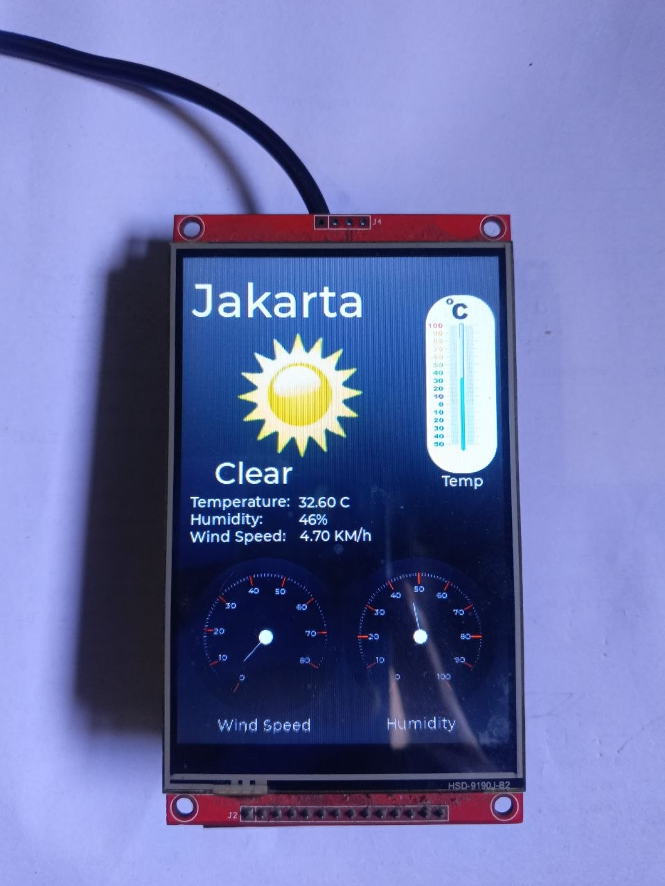

# OpenMeteo-Weather-Station-ESP32

A smart, touch-enabled weather station built with an ESP32. This project uses **LVGL** (Light and Versatile Graphics Library) for a smooth graphical interface and **FreeRTOS** to handle multitasking, ensuring the UI remains responsive while weather data is fetched in the background.

It connects to Wi-Fi and fetches real-time forecast data from the [Open-Meteo API](https://open-meteo.com/).



## ✨ Features

- **Real-Time Weather Data:** Fetches temperature, humidity, wind speed, and weather conditions.
- **Multi-City Support:** Pre-configured for Jakarta, Surabaya, Bandung, and Yogyakarta.
- **Touch Gestures:** Swipe left or right on the touchscreen to cycle through different cities.
- **Multitasking (FreeRTOS):** Separates the display rendering task from the Wi-Fi/HTTP request task to prevent UI freezing.
- **Dynamic UI Updates:** Translates WMO weather codes into readable text and dynamically updates weather icons.
- **Memory Monitoring:** Built-in stack high-water mark monitoring via Serial to keep track of FreeRTOS memory consumption.

## 🛠 Hardware Requirements

- **ESP32** Development Board
- **TFT Display** (ST7796) compatible with `TFT_eSPI`.
- **XPT2046 Touch Controller** (Touch CS pin configured to `21`).

## 📦 Software Dependencies

You will need the following libraries installed in your Arduino IDE / PlatformIO environment:

- [TFT_eSPI](https://github.com/Bodmer/TFT_eSPI) (Configuring `User_Setup.h` via `platformio.ini`)
- [XPT2046_Touchscreen](https://github.com/PaulStoffregen/XPT2046_Touchscreen)
- [lvgl](https://github.com/lvgl/lvgl) (Configuring `lv_conf.h` via `platformio.ini`)
- [ArduinoJson](https://arduinojson.org/) (Version 6.x)

## 🚀 Setup & Configuration

**1. Clone or Download the Repository**  
Ensure the main `main.cpp` file is in the same directory as your `ui/` folder.

**2. Configure Wi-Fi**  
At the top of the main code file, update the Wi-Fi credentials to match your network:

```cpp
#define WIFI "your_wifi_ssid"
#define PASS "your_wifi_password"
```

**3. Configure Fetch Delay**  
By default, the weather data updates every 1 minute. You can change this by modifying the `fetchDelay` definition:

```cpp
#define fetchDelay 1 // In Minutes
```

**4. Modify Locations (Optional)**  
You can add or change the cities by modifying the `coordinate` array. It uses the format `{"City Name", "Latitude", "Longitude"}`:

```cpp
const char *coordinate[][3] = {
    {"Jakarta", "-6.20", "106.82"},
    {"Surabaya", "-7.25", "112.75"},
    {"Bandung", "-6.91", "107.61"},
    {"Yogyakarta", "-7.79", "110.36"}
};
```
